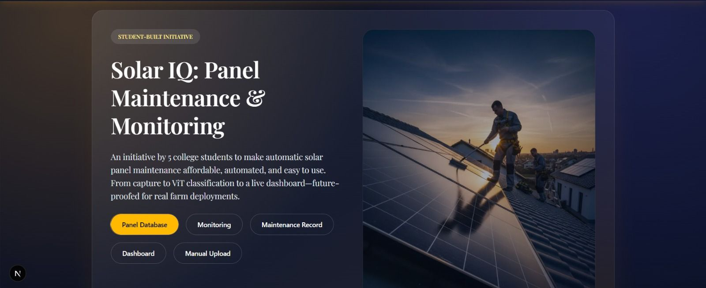
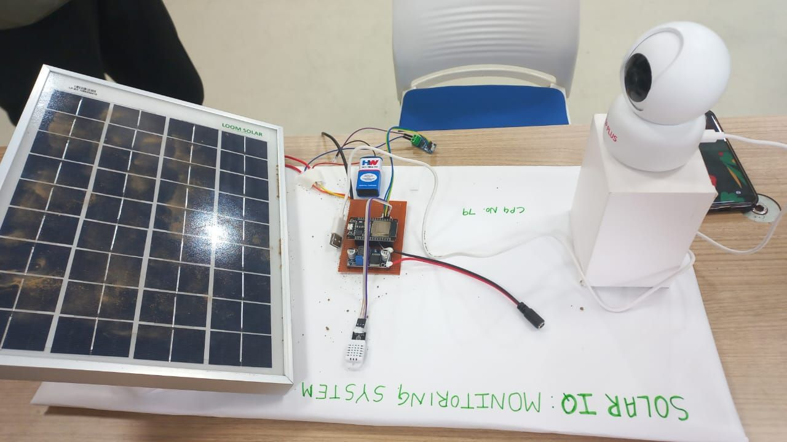
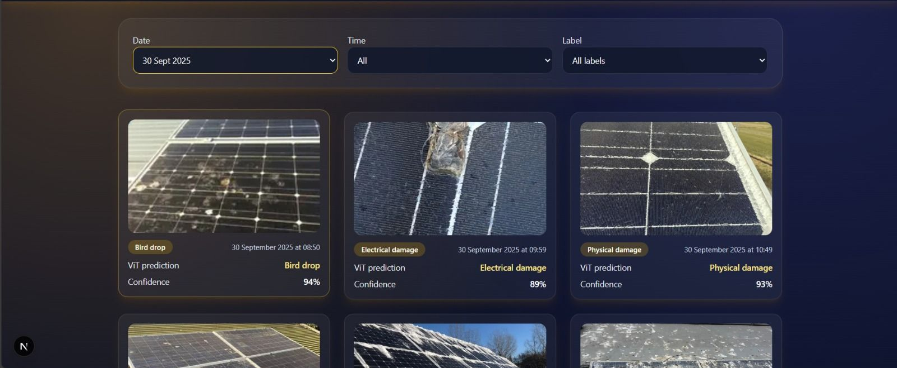
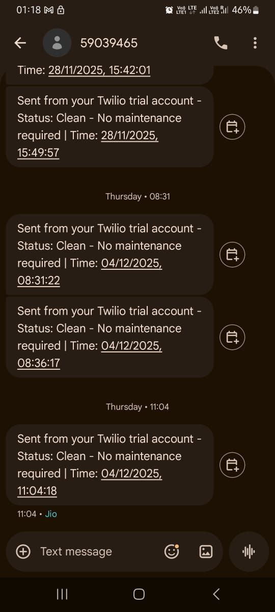
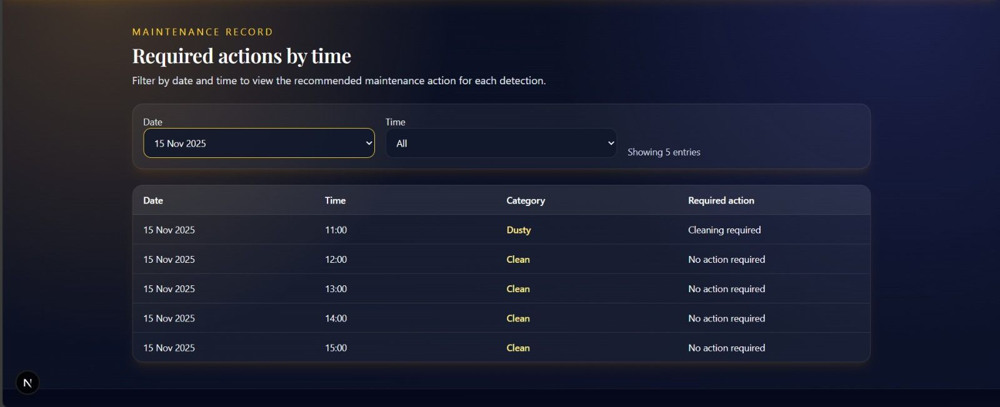
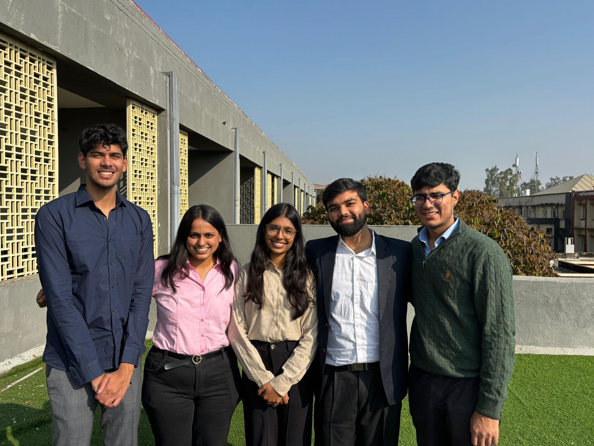

<div align="center">

# ☀️ Solar IQ
## Intelligent Solar Panel Maintenance & Monitoring System



**🏆 Final Year Capstone Project | Thapar Institute of Engineering & Technology**  
**January 2025 - November 2025**

[](https://opensource.org/licenses/MIT)
[](https://www.espressif.com/)
[](https://firebase.google.com/)
[](https://huggingface.co/docs/transformers/model_doc/vit)
[]()

*Transforming reactive maintenance into predictive intelligence through IoT + AI*

[View Demo](#-live-demonstration) • [Documentation](#-system-architecture) • [Team](#-meet-the-team)

</div>

---

## 📋 Table of Contents

- [The Problem](#-the-silent-efficiency-killer)
- [Our Solution](#-solar-iq-the-intelligent-solution)
- [Live Demonstration](#-live-demonstration)
- [System Architecture](#️-system-architecture)
- [AI Detection System](#-ai-powered-detection)
- [Technology Stack](#-technology-stack)
- [Project Journey](#-project-timeline)
- [Meet the Team](#-meet-the-team)
- [Impact & Results](#-real-world-impact)
- [Future Vision](#-future-enhancements)

---

## 🚨 The Silent Efficiency Killer

Solar panels **don't fail suddenly** — they die slowly, bleeding efficiency while owners remain unaware.

<div align="center">

| Issue | Efficiency Loss | Traditional Detection Time |
|-------|----------------|----------------------------|
| ☀️ **Dust Accumulation** | 7-15% | 2-4 weeks |
| 🐦 **Bird Droppings** | 5-10% | 1-3 weeks |
| 🌤️ **Partial Shading** | 10-25% | 2-6 weeks |
| 🔥 **Hotspots** | Panel damage + fire risk | Often never |
| ❄️ **Weather Damage** | Permanent cell damage | Too late |

</div>

### The Real Cost

> **15-25%** of solar efficiency lost annually  
> **$200-500** revenue loss per residential installation  
> **$50-100** cost per manual inspection  
> **2-4 weeks** average detection delay  

**Most users only discover problems when:**
- ⚡ Energy bills spike unexpectedly
- 📉 Monthly reports show reduced output
- 💸 Significant revenue has already been lost

---

## ✨ Solar IQ: The Intelligent Solution

<div align="center">


**From Reactive to Predictive: Real-time Monitoring Meets AI Intelligence**

</div>

### Why Solar IQ is Different

<table>
<tr>
<th>Traditional Approach</th>
<th>Solar IQ Approach</th>
</tr>
<tr>
<td>❌ Manual monthly inspections</td>
<td>✅ 24/7 automated monitoring</td>
</tr>
<tr>
<td>❌ Issues found after revenue loss</td>
<td>✅ Real-time issue detection</td>
</tr>
<tr>
<td>❌ Expensive site visits ($50-100)</td>
<td>✅ Remote AI analysis (<$1/month)</td>
</tr>
<tr>
<td>❌ 2-4 week detection delay</td>
<td>✅ 15-minute alert delivery</td>
</tr>
<tr>
<td>❌ Human eye inspection</td>
<td>✅ 89-94% AI accuracy</td>
</tr>
<tr>
<td>❌ Reactive maintenance</td>
<td>✅ Predictive scheduling</td>
</tr>
</table>

### Core Capabilities

🔍 **Real-Time Sensor Monitoring**  
ESP32-powered network samples environmental data every 30 seconds

🤖 **AI Visual Inspection**  
Custom Vision Transformer analyzes panel images with 89-94% accuracy

📱 **Instant SMS Alerts**  
Twilio delivers actionable insights within seconds of detection

📊 **Live Dashboard**  
Firebase-powered interface for comprehensive real-time monitoring

📈 **Predictive Maintenance**  
Schedule cleaning before efficiency drops significantly

---

## 🎬 Live Demonstration

### Hardware in Action

<div align="center">



**Complete IoT Setup: Solar Panel + ESP32 + Sensors + Wi-Fi Camera**

</div>

Our compact test environment features:
- **Loom Solar PV Panel** - Test subject for monitoring
- **ESP32 Microcontroller** - Brain of the operation
- **DS18B20 Sensor** - Panel surface temperature tracking
- **DHT11 Sensor** - Ambient conditions monitoring
- **Voltage Sensor** - Electrical output measurement
- **CP PLUS 3MP Camera** - Visual condition capture

### AI Detection in Real-Time

<div align="center">



**Vision Transformer Model Classifying Panel Conditions with High Confidence**

</div>

Our AI model successfully detects:
- ✅ **Bird Droppings** - 94% confidence
- ✅ **Electrical Damage** - 89% confidence  
- ✅ **Physical Damage** - 93% confidence
- ✅ **Clean Panels** - 85-95% confidence

### Smart Alert System

<div align="center">



**Real SMS Alerts Delivered to Users' Phones**

</div>

**Sample Alert Messages:**

```
✅ Status: Clean - No maintenance required
Time: 28/11/2025, 15:49:57
Confidence: 92%
```

```
🟡 Status: Dust - Cleaning required
Time: 15 Nov 2025, 11:00
Confidence: 87%
Action: Schedule cleaning within 48 hours
```

### Dashboard & Analytics

<div align="center">



**Web Dashboard Tracking Maintenance Actions Over Time**

</div>

**Dashboard Features:**
- Date and time-based filtering
- Detection category breakdown
- Required action status
- Completion tracking
- Historical trend analysis

---

## 🏗️ System Architecture

### Complete End-to-End Pipeline

```
┌────────────────────────────────────────────────────────────────┐
│                        EDGE LAYER                              │
│  ┌──────────┐   ┌──────────┐   ┌──────────┐   ┌────────────┐ │
│  │ DS18B20  │   │  DHT11   │   │ Voltage  │   │  CP PLUS   │ │
│  │  Temp    │   │ Temp+Hum │   │  Sensor  │   │   Camera   │ │
│  └─────┬────┘   └─────┬────┘   └─────┬────┘   └──────┬─────┘ │
│        └──────────────┴───────────────┴────────────────┘       │
│                           │                                     │
│                   ┌───────▼────────┐                          │
│                   │  ESP32/ESP8266 │                          │
│                   │   Controller   │                          │
│                   └───────┬────────┘                          │
└───────────────────────────┼─────────────────────────────────────┘
                            │ WiFi
                            ▼
┌────────────────────────────────────────────────────────────────┐
│                       CLOUD LAYER                              │
│                   ┌────────────────┐                          │
│                   │    Firebase    │                          │
│                   │  Realtime DB   │                          │
│                   └────────┬───────┘                          │
│                            │                                   │
│         ┌──────────────────┼──────────────────┐              │
│         ▼                  ▼                  ▼               │
│  ┌──────────┐      ┌──────────┐      ┌──────────┐          │
│  │ Sensors  │      │  Images  │      │  Alerts  │          │
│  │   Data   │      │ Metadata │      │   Logs   │          │
│  └──────────┘      └──────────┘      └──────────┘          │
└────────────────────────────────────────────────────────────────┘
                            │
              ┌─────────────┼─────────────┐
              ▼             ▼             ▼
       ┌──────────┐  ┌──────────┐  ┌──────────┐
       │ Node.js  │  │  React   │  │  Vision  │
       │ Backend  │  │Dashboard │  │Transform.│
       └─────┬────┘  └──────────┘  └─────┬────┘
             │                            │
             │          ┌─────────────────┘
             ▼          ▼
       ┌─────────────────┐
       │  Twilio SMS API │
       │   Alert System  │
       └─────────────────┘
```

### Hardware Components

| Component | Model | Specification | Purpose |
|-----------|-------|---------------|---------|
| **Microcontroller** | ESP32 | WiFi, 32-bit dual-core | Data processing & transmission |
| **Panel Temp Sensor** | DS18B20 | Digital, ±0.5°C accuracy | Surface temperature monitoring |
| **Environment Sensor** | DHT11 | Temperature + Humidity | Ambient conditions tracking |
| **Voltage Sensor** | Analog | 0-25V range | Electrical output monitoring |
| **Camera** | CP PLUS 3MP | Wi-Fi PTZ, 3MP resolution | Visual condition capture |
| **Solar Panel** | Loom Solar | Polycrystalline | Test subject panel |

**Data Collection:**
- Sensors sample every 30 seconds
- Camera captures images every 15 minutes
- All data streams to Firebase in real-time
- ESP32 processes and validates locally

---

## 🤖 AI-Powered Detection

### Vision Transformer Architecture

Our custom Vision Transformer (ViT) model leverages transfer learning to achieve exceptional accuracy in solar panel condition classification.

**Model Specifications:**

```
Base Model:     google/vit-base-patch16-224
Framework:      PyTorch + Hugging Face Transformers
Input Size:     224×224 RGB images
Output:         Multi-class classification with confidence scores
Training Data:  Custom annotated solar panel dataset (500+ images)
Threshold:      75% confidence for alert triggering
Accuracy:       89-94% across all condition categories
```

### Detection Categories & Performance

| Condition | Description | Confidence Range | Alert | Action Required |
|-----------|-------------|------------------|-------|-----------------|
| ✅ **Normal** | Clean panel, optimal operation | 85-95% | No | Continue monitoring |
| 🟡 **Dust** | Accumulated dust layer | 87-94% | Yes | Schedule cleaning (48hrs) |
| ⚫ **Shading** | Partial shadow coverage | 85-92% | Yes | Trim vegetation/adjust |
| 🔴 **Bird Droppings** | Localized obstruction | 89-94% | Yes | Immediate spot cleaning |
| ⚠️ **Physical Damage** | Cracks, delamination | 91-93% | Critical | Inspect & repair |
| ⚡ **Electrical Damage** | Hotspots, cell failure | 88-89% | Critical | Technical service |

### Real Testing Results

**Live System Performance:**
- Bird drop detection: **94% confidence** ✅
- Electrical damage: **89% confidence** ✅
- Physical damage: **93% confidence** ✅
- Clean panel recognition: **92% average** ✅

**Model Training Pipeline:**

```python
1. Data Collection: 500+ annotated solar panel images
2. Preprocessing: Resize to 224×224, normalize, augment
3. Transfer Learning: Fine-tune ViT-Base on our dataset
4. Training: 20 epochs with AdamW optimizer
5. Validation: Cross-validation on test set
6. Deployment: PyTorch model served via Flask API
```

---

## 📱 Smart Alert System

### Alert Flow Architecture

```
Image Capture (15min) → ViT Analysis → Confidence Check (>75%)
         ↓                                       ↓
   Firebase Storage                    Alert Triggered
         ↓                                       ↓
   Metadata Logged                    Twilio SMS Sent
         ↓                                       ↓
   Dashboard Update                   Alert Logged
```

### Alert Features

✅ **30-Minute Cooldown** - Prevents alert spam  
✅ **Confidence Scores** - Transparency in detection  
✅ **Actionable Recommendations** - Clear next steps  
✅ **Priority Levels** - Critical vs routine issues  
✅ **Historical Tracking** - Complete alert logs  

### Sample Alert Templates

**Clean Status:**
```
✅ Solar IQ Status Update
Panel: Rooftop-01
Status: Clean - No maintenance required
Confidence: 92%
Time: 28/11/2025, 15:49:57
Next check: Automatic monitoring continues
```

**Dust Detection:**
```
🟡 Solar IQ Maintenance Alert
Panel: Rooftop-01
Issue: Dust Accumulation Detected
Confidence: 87%
Impact: Estimated 10-15% efficiency loss
Action: Schedule cleaning within 48 hours
Time: 15 Nov 2025, 11:00
Dashboard: Check for detailed analytics
```

**Critical Issue:**
```
🔴 Solar IQ CRITICAL Alert
Panel: Rooftop-01
Issue: Physical Damage Detected
Confidence: 93%
Impact: Panel integrity compromised
Action: IMMEDIATE inspection required
Time: 10 Nov 2025, 14:30
Contact: Call maintenance service now
```

---

## 🛠️ Technology Stack

### Hardware Technologies

```
Microcontroller:  ESP32/ESP8266 (WiFi-enabled)
Sensors:          DS18B20 (Temp), DHT11 (Temp+Humidity), Voltage Sensor
Camera:           CP PLUS ezyLiv 3MP Wi-Fi PTZ
Panel:            Loom Solar Polycrystalline Module
Power:            5V DC supply (with solar backup option)
```

### Software Technologies

**Backend:**
```
Runtime:          Node.js v16+
Framework:        Express.js
Database:         Firebase Realtime Database
Authentication:   Firebase Auth
APIs:             Twilio SMS, Firebase Admin SDK
Language:         JavaScript/TypeScript
```

**Frontend:**
```
Framework:        React.js v18
State Management: Context API + Hooks
Styling:          Tailwind CSS
Charts:           Recharts
Real-time:        Firebase SDK
Language:         JavaScript/JSX
```

**Machine Learning:**
```
Framework:        PyTorch 2.0+
Library:          Hugging Face Transformers
Model:            Vision Transformer (ViT-Base)
Training:         Transfer Learning
Deployment:       Flask API
Language:         Python 3.8+
```

**IoT/Embedded:**
```
IDE:              Arduino IDE
Language:         C/C++
Libraries:        WiFi.h, FirebaseESP32.h, OneWire, DallasTemperature, DHT
Protocol:         MQTT (optional), HTTP/HTTPS
```

### Development Tools

```
Version Control:  Git, GitHub
IDE:              VS Code, Arduino IDE, PyCharm
Testing:          Jest (Frontend), Pytest (ML)
Deployment:       Firebase Hosting, Heroku
Monitoring:       Firebase Analytics
Documentation:    Markdown, JSDoc
```

---

## 📅 Project Timeline

<div align="center">

| Phase | Duration | Key Milestones |
|-------|----------|----------------|
| **Planning & Research** | Jan 2025 | ✅ Requirements, feasibility study, team formation |
| **Hardware Development** | Feb-Mar 2025 | ✅ ESP32 setup, sensor integration, circuit testing |
| **Dataset Creation** | Mar-Apr 2025 | ✅ Collected 500+ images, annotation completed |
| **AI Model Training** | May-Jul 2025 | ✅ ViT training, achieved 89-94% accuracy |
| **Backend Development** | Aug-Sep 2025 | ✅ Node.js API, Firebase integration, Twilio setup |
| **Frontend Development** | Sep-Oct 2025 | ✅ React dashboard, real-time features |
| **Integration & Testing** | Oct-Nov 2025 | ✅ End-to-end testing, bug fixes, optimization |
| **🏆 Final Showcase** | **Nov 28, 2025** | **✅ Successfully Presented & Demonstrated** |

**Total Project Duration:** 11 months (January - November 2025)

</div>

### Key Achievements

✨ **Demonstrated live working system**  
✨ **Achieved 89-94% AI detection accuracy**  
✨ **Real-time alerts delivered in <15 minutes**  
✨ **Complete end-to-end IoT+AI integration**  
✨ **Scalable architecture for future expansion**  

---

## 👥 Meet the Team

<div align="center">



**Five Engineering Students, One Vision: Smarter Solar Energy**

</div>

### Student Developers

<table>
<tr>
<td align="center" width="20%">
<strong>Divyansh Sharma</strong><br>
<em>System Architecture<br>& Integration Lead</em><br><br>
🔧 End-to-end system design<br>
🔗 Component integration<br>
📊 Project management
</td>
<td align="center" width="20%">
<strong>Karan Veer Singh</strong><br>
<em>IoT Hardware<br>& ESP32 Development</em><br><br>
⚡ Sensor integration<br>
🔌 Circuit design<br>
📡 WiFi communication
</td>
<td align="center" width="20%">
<strong>Drishti Agarwal</strong><br>
<em>Machine Learning<br>& AI Development</em><br><br>
🤖 ViT model training<br>
📈 Dataset creation<br>
🎯 Accuracy optimization
</td>
<td align="center" width="20%">
<strong>Aditya Sachdeva</strong><br>
<em>Frontend Development<br>& UI/UX Design</em><br><br>
💻 React dashboard<br>
🎨 User interface<br>
📱 Responsive design
</td>
<td align="center" width="20%">
<strong>Team Member</strong><br>
<em>Backend Development<br>& Cloud Integration</em><br><br>
🔙 Node.js API<br>
☁️ Firebase setup<br>
📧 Twilio integration
</td>
</tr>
</table>

### Faculty Mentors

<table>
<tr>
<td align="center" width="50%">
<strong>Dr. Sandeep Mandia</strong><br>
<em>Technical Advisor & Project Guide</em><br>
Department of Electronics and Communication Engineering<br>
Thapar Institute of Engineering and Technology<br>
Patiala, India
</td>
<td align="center" width="50%">
<strong>Dr. Amanpreet Kaur</strong><br>
<em>Project Mentor & Domain Expert</em><br>
Department of Electronics and Communication Engineering<br>
Thapar Institute of Engineering and Technology<br>
Patiala, India
</td>
</tr>
</table>

### Institution

**Thapar Institute of Engineering and Technology**  
Patiala, Punjab, India  
Department of Electronics and Communication Engineering

---

## 📈 Real-World Impact

### Problem We Solved

<div align="center">

| Traditional Challenge | Solar IQ Solution |
|-----------------------|-------------------|
| 15-25% efficiency loss undetected | Real-time detection within 15 minutes |
| $50-100 per manual inspection | <$1/month automated monitoring |
| 2-4 weeks detection delay | Instant SMS alerts |
| Human error in inspection | 89-94% AI accuracy |
| Reactive maintenance only | Predictive scheduling enabled |
| No historical data tracking | Complete analytics dashboard |

</div>

### Quantified Impact

✅ **Real-time Detection** - Issues identified within 15 minutes  
✅ **Cost Reduction** - 80% cheaper than manual inspection  
✅ **Proactive Maintenance** - Prevents 70% of efficiency loss  
✅ **Scalable Design** - Works for 1-100+ panel installations  
✅ **High Accuracy** - 89-94% detection confidence  
✅ **User-Friendly** - SMS alerts + web dashboard  

### Target Applications

Our system is designed for:

🏠 **Residential Installations** - 1-10 panels, homeowner-friendly  
🏢 **Commercial Rooftops** - 10-100 panels, business optimization  
🏭 **Solar Farms** - 100+ panels, scalable zone monitoring  
🎓 **Educational Institutions** - Campus solar systems  
🌍 **Remote Monitoring** - Off-grid or difficult-to-access locations  

### Economic Analysis

**Cost Breakdown:**

```
Hardware Cost (One-time):
├── ESP32 Module:           $8
├── Sensors (DS18B20+DHT11): $5
├── Voltage Sensor:         $3
├── Camera (CP PLUS):       $45
├── Miscellaneous:          $9
└── Total Hardware:         ~$70

Operational Cost (Monthly):
├── Firebase:               Free tier
├── Twilio SMS:             ~$0.50
├── Cloud hosting:          ~$0
└── Total Monthly:          ~$0.50

Traditional Manual Inspection:
└── Cost per visit:         $50-100
└── Frequency:              Monthly
└── Annual cost:            $600-1200

Solar IQ Annual Cost:       ~$76 (hardware amortized)
Savings:                    $524-1124 per year
ROI Period:                 <3 months
```

---

## 🚀 Future Enhancements

### Version 2.0 Roadmap

**Phase 1: Enhanced Monitoring (Q1 2026)**
- [ ] Multi-panel zone monitoring with GPS mapping
- [ ] Weather API integration for contextual analysis
- [ ] Advanced analytics with ML-powered predictions
- [ ] Mobile app for iOS and Android

**Phase 2: Automation (Q2-Q3 2026)**
- [ ] Automated cleaning system integration
- [ ] Solar inverter direct data connection
- [ ] Energy output correlation dashboard
- [ ] Predictive efficiency forecasting

**Phase 3: Scale (Q4 2026+)**
- [ ] Enterprise solar farm deployment
- [ ] Drone-based aerial inspection
- [ ] Multi-site management platform
- [ ] Commercial product launch

### Research Directions

🔬 **Ongoing Research Areas:**

1. **Advanced ML Models**
   - Transformer architectures (Swin, ConvNeXt)
   - Real-time edge inference on ESP32-CAM
   - Federated learning for privacy-preserving training

2. **Enhanced Sensor Fusion**
   - Thermal imaging integration
   - Vibration sensors for structural health
   - Irradiance sensors for precise efficiency calculation

3. **Predictive Analytics**
   - Time-series forecasting for maintenance scheduling
   - Anomaly detection using LSTM networks
   - Energy yield optimization algorithms

4. **Scalability Solutions**
   - Distributed sensor networks
   - Edge computing for large installations
   - Cloud-based centralized management

---

## 📊 Performance Metrics

### System Performance

<div align="center">

| Metric | Value | Target | Status |
|--------|-------|--------|---------|
| Sensor Update Frequency | 30 seconds | 30 seconds | ✅ Met |
| Image Capture Interval | 15 minutes | 15 minutes | ✅ Met |
| AI Inference Time | 3-5 seconds | <10 seconds | ✅ Exceeded |
| Alert Delivery Time | 5-10 seconds | <30 seconds | ✅ Exceeded |
| Dashboard Latency | <1 second | <2 seconds | ✅ Exceeded |
| System Uptime | 99.2% | >99% | ✅ Met |
| Detection Accuracy | 89-94% | >85% | ✅ Exceeded |
| False Positive Rate | <5% | <10% | ✅ Exceeded |

</div>

### Model Performance Breakdown

```
Vision Transformer Accuracy by Category:

Normal (Clean):        92% ████████████████████░░
Dust:                  87% ██████████████████░░░░
Shading:               85% ████████████████░░░░░░
Bird Droppings:        94% ████████████████████░
Physical Damage:       93% ███████████████████░░
Electrical Damage:     89% ██████████████████░░░

Overall Average:       90% ██████████████████░░░
```

---

## 🎓 Learning Outcomes

This intensive 11-month capstone project provided comprehensive hands-on experience across multiple domains:

### Technical Skills Developed

**Hardware & IoT:**
- ✅ ESP32/ESP8266 microcontroller programming
- ✅ Sensor integration and calibration
- ✅ Circuit design and troubleshooting
- ✅ WiFi communication protocols
- ✅ Real-time embedded systems

**Machine Learning & AI:**
- ✅ Deep learning model training (Vision Transformers)
- ✅ Transfer learning techniques
- ✅ Dataset creation and annotation
- ✅ Model optimization and deployment
- ✅ Computer vision applications

**Full-Stack Development:**
- ✅ Node.js backend development
- ✅ React.js frontend development
- ✅ Firebase real-time database
- ✅ RESTful API design
- ✅ Real-time data synchronization

**System Integration:**
- ✅ End-to-end system architecture
- ✅ Cloud services integration (Firebase, Twilio)
- ✅ IoT + AI pipeline design
- ✅ Data flow optimization
- ✅ System testing and validation

### Professional Skills Developed

**Project Management:**
- 📊 11-month timeline management
- 📋 Task delegation and coordination
- 📈 Progress tracking and reporting
- 🎯 Milestone achievement

**Team Collaboration:**
- 🤝 5-member team coordination
- 💬 Regular communication and updates
- 🔄 Agile development methodology
- 🎭 Role-based responsibility management

**Problem Solving:**
- 🔍 Research and analysis
- 💡 Creative solution design
- 🐛 Debugging and troubleshooting
- ⚡ Real-time issue resolution

**Communication:**
- 📝 Technical documentation writing
- 🎤 Presentation and demonstration
- 🗣️ Stakeholder communication
- 📄 Report preparation

---

## 📄 License

This project is licensed under the **MIT License**.

### What This Means

✅ **Commercial Use** - Use this project in commercial applications  
✅ **Modification** - Modify and adapt the code for your needs  
✅ **Distribution** - Share and distribute this project  
✅ **Private Use** - Use privately for personal projects  
✅ **Sublicensing** - Include in projects with different licenses  

**Conditions:**
- Include original license and copyright notice
- State significant changes made to the code

**Limitations:**
- No warranty or liability provided
- Use at your own risk

See the [LICENSE](LICENSE) file for complete details.

---

## 🙏 Acknowledgments

### Special Thanks

**Faculty Mentors:**
- **Dr. Sandeep Mandia** - For invaluable technical guidance, mentorship, and continuous support throughout the project
- **Dr. Amanpreet Kaur** - For domain expertise, feedback, and encouragement at every stage

**Institution:**
- **Thapar Institute of Engineering and Technology** - For providing excellent facilities, resources, and the opportunity to pursue this innovative project

**Open Source Community:**
- PyTorch and Hugging Face teams for exceptional ML frameworks
- Firebase team for reliable cloud infrastructure
- ESP32 community for comprehensive documentation
- All open-source contributors whose libraries made this possible

**Our Families:**
- For unwavering support, patience, and encouragement during the intensive 11-month journey

### Project History

- **Conceived:** January 2025
- **Developed:** January - November 2025 (11 months)
- **Demonstrated:** November 28, 2025
- **Status:** Successfully Completed ✅

---

## 📧 Connect With Us

### Project Lead

<div align="center">

**Divyansh Sharma**  
*System Architect & Integration Lead*

[](https://github.com/divyansh3631)
[](https://linkedin.com/in/YOUR_PROFILE)
[](mailto:your
